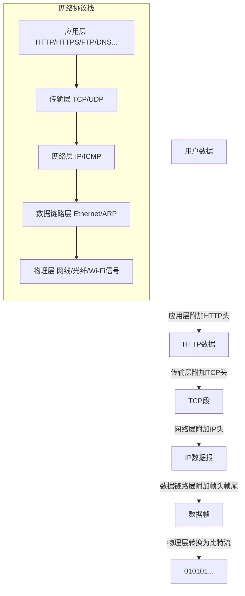
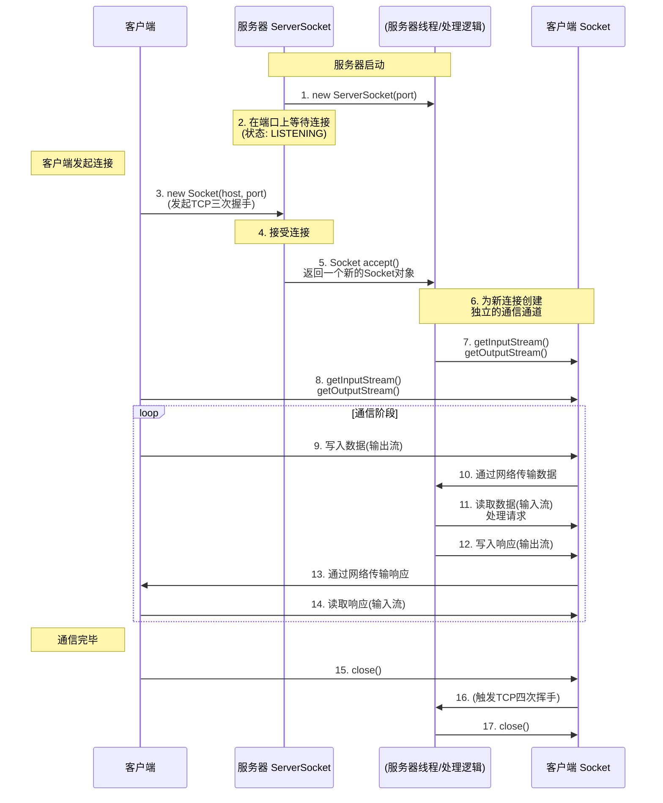
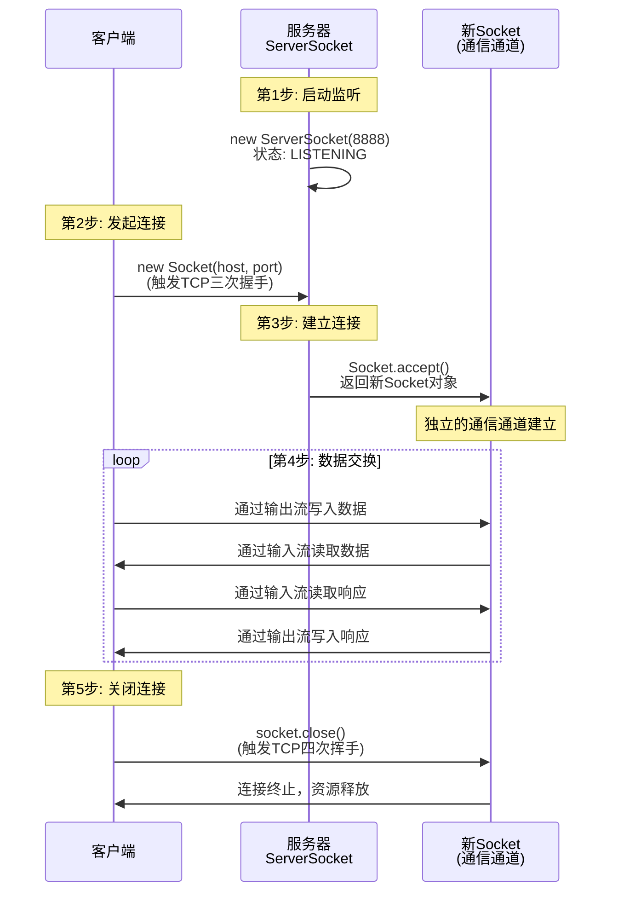
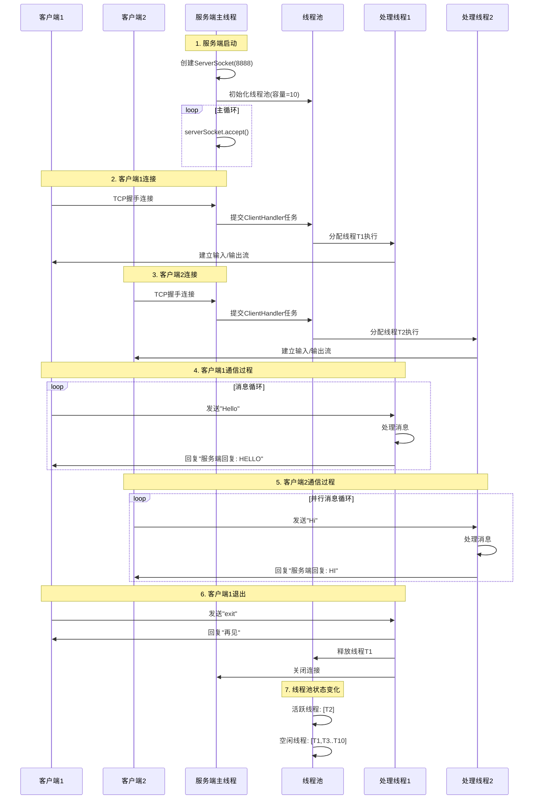
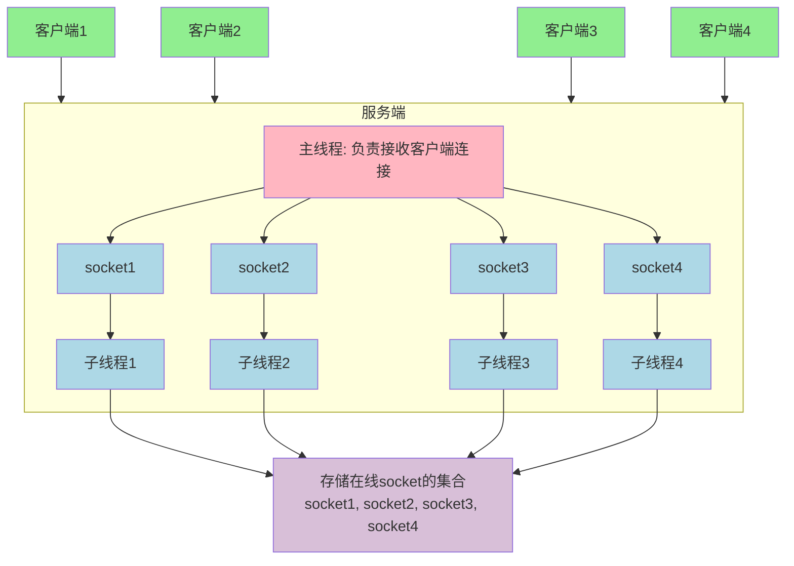
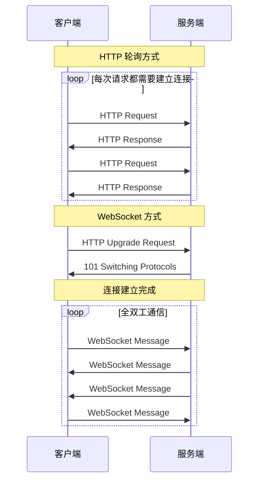

# Java网络编程入门指南：从基础到实战

> **技术人的浪漫，藏在每一个精心编写的逻辑里，藏在每一段稳定运行的代码中。今日正值七夕节，愿各位在追求技术卓越的同时，也能收获生活中的美好与温暖。**

## 前言：开启网络编程之旅

在当今互联网时代，掌握网络编程基础已成为Java开发者必备的技能之一。无论是开发简单的客户端/服务器应用，还是理解Web应用背后的通信原理，网络编程知识都不可或缺。

本文是一篇面向初学者的Java网络编程入门指南，将系统性地介绍：

- 网络通信的基本概念与三要素
- IP地址与端口号的基础知识
- TCP与UDP协议的核心区别
- Java网络API的基本使用方法
- 简单的客户端/服务器实现示例
- WebSocket的初步认识

作为入门教程，我不会深入探讨底层协议细节或高性能网络编程，而是聚焦于帮助初学者建立清晰的概念框架，并提供可直接运行的代码示例。无论你是刚开始学习Java网络编程，还是需要回顾基础知识，这篇文章都将为你提供实用的参考。

让我们从最基本的网络概念开始，逐步探索Java网络编程的世界。

## 1、网络编程概述

**什么是网络编程**

* 可以让设备中的程序与网络上其它设备中的程序进行数据交互（实现网络通信的）

**基本的通信架构**

* 基本的通信架构有2种形式：CS架构（Client客户端/Server服务端）、BS架构（Browser浏览器/Server服务端）
* CS架构
    * 客户端：
        * 需要程序员开发
        * 用户需要安装
    * 服务端
        * 需要程序员开发实现
* BS架构
    * 浏览器：
        * 不需要程序员开发
        * 用户需要安装浏览器
    * 服务端：
        * 需要程序员开发是心啊

**无论是CS架构，还是BS架构的软件都必须依赖网络编程。**

## 2、通信三要素

### 2.1IP地址

> 设备在网络中的地址，是唯一的标识。

IP（Internet protocol）：全称“互连网协议地址”，是分配给上网设备的唯一标志

IP地址有两种形式IPv4、IPv6

#### 2.1.1IPv4

##### 1、地址格式与表示

- **长度**：32位二进制数。
- **表示方法**：为了便于人类阅读和书写，采用**点分十进制**表示法。将32位分成4个8位的部分（称为8位组或字节），每个部分转换为十进制数，然后用点号分隔。
    - **二进制**：`11000000 10101000 00000001 00000001`
    - **十进制**：`192.168.1.1`
- **地址空间**：2³² ≈ **42.9亿**个地址。

##### 2、地址结构：网络位 + 主机位

一个IPv4地址由两部分组成：

- **网络位 (Network Portion)**：标识设备所属的**特定网络**（就像邮政编码或城市区号）。
- **主机位 (Host Portion)**：标识该网络中的**特定设备**（就像街道门牌号）。

如何区分哪部分是网络位，哪部分是主机位？由**子网掩码 (Subnet Mask)** 决定。

- 子网掩码也是32位，通常是一串连续的1后面跟着连续的0。
- `1`对应的IP地址位是**网络位**。
- `0`对应的IP地址位是**主机位**。
- **举例**：
    - IP 地址：`192.168.1.100`
    - 子网掩码：`255.255.255.0`（二进制：`11111111.11111111.11111111.00000000`）
    - 这意味着前24位是网络位（`192.168.1`），后8位是主机位（`.100`）。所以这个设备在 `192.168.1.0`这个网络中。

##### 3、IPv4 的核心问题：地址枯竭

尽管有约43亿个地址，但由于早期分配不合理和互联网爆炸式发展，**公网IPv4地址早已分配殆尽**。这催生了两种主要技术：

1. **NAT (网络地址转换)**：让多个私有地址设备共享一个公网IP访问互联网。路由器就在做这件事。
2. **IPv6**：从根本上解决问题的下一代协议。

#### 2.1.2 IPv6

IPv6 是为解决 IPv4 地址枯竭问题而设计的下一代协议，并带来了许多其他改进。

##### 1. 地址格式与表示

- **长度**：**128位**二进制数。地址空间大到惊人：2¹²⁸ ≈ **3.4×10³⁸** 个地址。这意味着地球上每粒沙子都可以分配到一个IP地址。
- **表示方法**：**十六进制冒号分界**表示法。将128位分成8组，每组16位，用冒号分隔每组转换为4位十六进制数。
    - **示例**：`2001:0db8:85a3:0000:0000:8a2e:0370:7334`
- **简化规则**：
    1. **省略前导零**：每组中的前导0可以省略。
        - `0db8`-> `db8`
        - `0370`-> `370`
    2. **压缩零**：**连续**的多组 `0000`可以用**双冒号 `::`** 代替，但**只能使用一次**。
        - `2001:0db8:0000:0000:0000:0000:1428:57ab`
        - 可简化为：`2001:db8::1428:57ab`

##### 2. IPv6 的优势与特点 (相比 IPv4)

1. **巨大的地址空间**：根本解决了地址耗尽问题。
2. **简化的报头格式**：IPv6报头结构更简单，字段更少，路由器处理效率更高，转发更快。
3. **无需NAT**：每个设备都可以拥有全球唯一的公网地址，端到端连接更直接，简化了网络设计。
4. **内置安全性**：**IPsec**（用于加密和认证网络层通信）原本是IPv6的强制要求，但在IPv4中只是可选。
5. **更好的支持移动性**：设计之初就考虑了移动设备，切换网络时能更好地保持连接。
6. **自动配置**：**无状态地址自动配置 (SLAAC)** 允许设备仅通过接收网络路由器公告的消息就能给自己配置一个IPv6地址，无需DHCP服务器。
7. **原生支持多播**：更高效地处理一对多通信。

##### 3. IPv6 地址类型

- **单播 (Unicast)**：标识一个接口。发送到单播地址的数据包会被交付给该特定接口。
- **组播 (Multicast)**：标识一组接口。发送到组播地址的数据包会被交付给该组中的所有接口（IPv4中的广播功能在IPv6中被组播取代）。
- **任播 (Anycast)**：标识一组接口。发送到任播地址的数据包只会被交付给该组中**最近**的一个接口（通常用于DNS根服务器、CDN等，实现负载均衡和冗余）。

####  2.1.3IPv4 与 IPv6 对比总结

| 特性                     | IPv4                       | IPv6                             |
| :----------------------- | :------------------------- | :------------------------------- |
| **地址长度**             | 32位                       | 128位                            |
| **地址表示**             | 点分十进制 (`192.168.1.1`) | 十六进制冒号分隔 (`2001:db8::1`) |
| **地址数量**             | 约42.9亿                   | 近乎无限 (3.4x10³⁸)              |
| **配置方式**             | 手动或DHCP                 | 手动、DHCPv6 或 **SLAAC**        |
| **安全性**               | IPsec 为可选               | IPsec 为内建设计                 |
| **数据包 fragmentation** | 由发送方和路由进行         | 仅由发送方进行                   |
| **广播**                 | 有                         | **无**（由组播功能实现）         |
| **必需校验和**           | 有                         | **无**（依赖上层协议）           |
| **典型共存技术**         | NAT                        | 双栈、隧道                       |

#### 2.1.4查看设备的IP地址

##### 1、在 Linux 终端中：

```shell
# 查看所有网络接口的信息（IPv4和IPv6）
ip addr show
# 或缩写
ip a

# 通常，IPv4地址在 `inet` 后面，IPv6地址在 `inet6` 后面。
# 例如： inet 192.168.1.100/24, inet6 fe80::a00:27ff:fe4e:66a1/64
```

##### 2、在 Windows CMD 中：

```shell
ipconfig
```

#### 2.1.5IP域名

##### 1、核心比喻：IP地址 vs. 域名

想象一下互联网是一个巨大的全球邮政系统。

- **IP地址 (Internet Protocol Address)**：就像是设备的**精确地理坐标（经纬度）** 或**身份证号码**。
    - **特点**：**精准、唯一、机器友好**。它唯一地标识了网络上一台设备的位置，数据包依靠它才能被准确路由和送达。
    - **问题**：对人类极不友好。你很难记住你所有朋友家的经纬度坐标，对吧？
- **域名 (Domain Name)**：就像是设备的**友好名称** 或**通讯录里的联系人名字**。
    - **特点**：**易记、人类友好**。比如，记住 `google.com`远比记住 `142.251.42.206`要容易得多。
    - **问题**：机器无法直接理解这个名字。网络底层通信最终还是要依靠IP地址。

==**结论：域名是人类易于记忆的网站名称，而IP地址是机器用于定位和通信的数字标识。域名存在的唯一目的，就是为了让人类不用去记那些复杂的数字IP地址。**==

##### 2、DNS：互联网的“巨型电话簿”

那么，如何将人类友好的“域名”转换成机器友好的“IP地址”呢？这个至关重要的翻译官就是 **DNS (Domain Name System, 域名系统)**。

###### 1. DNS 的作用

DNS 是互联网的核心目录服务，它就像一个分布式的全球巨型电话簿。

- **你的操作**：在浏览器输入 `www.google.com`并按下回车。
- **DNS 的工作**：浏览器会立刻联系DNS系统，询问：“你好，`www.google.com`的IP地址是多少？”
- **DNS 的回复**：DNS系统查完“电话簿”后，回复：“它的IP地址是 `142.251.42.206`。”
- **最终连接**：浏览器拿到IP地址后，才真正开始向 `142.251.42.206`发起HTTP连接，请求网页内容。

**没有DNS，今天的互联网就无法使用。** 我们只能通过输入IP地址来访问网站。

###### 2. DNS 解析的详细过程（迭代查询）

这个过程比简单的“查电话簿”要复杂一些，它是一个分层、迭代的查询过程，涉及多种类型的DNS服务器。


**这个过程对用户是完全透明的，通常在毫秒内完成。**

#### 2.1.6公网IP、内网IP、特殊IP

* 公网IP：是可以连接互连网IP地址；

* 内网IP：也叫局域网IP，只能组织机构内部使用。
    * 192.168.开头的就是常见的局域网地址，方位即为192.168.0.0~192.168.255.255，专门为组织机构内部使用。
* 特殊IP地址：
    * 127.0.0.1、localhost：代表本机IP，只会寻找当前所在的主机

* IP常用命令
    * `ipconfig`：查看本机IP地址
    * `ping IP地址`：检查网络是否连通

#### 2.1.7`InetAddress`

学习 Java 网络编程，`InetAddress`类是遇到的第一个也是最重要的基础类之一。它就是之前学到的 **IP 地址（IPv4 或 IPv6）在 Java 世界中的抽象表示**。

##### 1、InetAddress 类是什么？

`java.net.InetAddress`类是一个表示互联网协议（IP）地址的对象。它的核心作用就是**将我们人类容易记忆的域名（如 `www.google.com`）解析成机器容易处理的 IP 地址（如 `142.251.42.206`）**，或者直接表示一个 IP 地址。

**关键特点：**

1. **无构造方法**：你不能直接 `new InetAddress()`。必须通过它提供的静态工厂方法来获取实例。
2. **处理双协议**：它同时支持 IPv4 和 IPv6 地址。你通常不需要关心底层是哪种类型，类会自动处理。
3. **不可变对象**：一旦被创建，其代表的 IP 地址就无法改变。
4. **可能代表主机名**：一个 `InetAddress`实例可以同时包含 IP 地址和对应的主机名（如果是通过域名解析得到的）。

##### 2、常用的实例方法

获取到 `InetAddress`对象后，可以调用以下方法来获取信息：

| 名称                                               | 说明                                                 |
| -------------------------------------------------- | ---------------------------------------------------- |
| `public static InetAddress getLocalHost()`         | 获取本机IP地址，会以一个 InetAddress 的对象返回。    |
| `public static InetAddress getByName(String host)` | 根据 IP 地址或者域名，返回一个 InetAddress 对象。    |
| `public String getHostName()`                      | 获取该 IP 地址对象对应的主机名。                     |
| `public String getHostAddress()`                   | 获取该 IP 地址对象中的 IP 地址信息。                 |
| `public boolean isReachable(int timeout)`          | 在指定毫秒内，判断主机与该 IP 对应的主机是否能连通。 |

##### 3、重要注意事项

1. **DNS 缓存**：Java 会对 DNS 查询结果进行缓存（为了性能）。有时你可能会拿到旧的、已过期的 IP 地址。缓存时间由网络安全策略控制。
2. **阻塞操作**：`getByName()`, `getAllByName()`, `getHostName()`, `isReachable()`等方法都是**阻塞式**的（同步的），会等待网络响应。在图形界面（GUI）程序中使用时，**务必放在后台线程**，否则会冻结界面。
3. `UnknownHostException`：这是检查型异常，必须进行捕获处理。当主机名无法被 DNS 解析时抛出。
4. `isReachable`**的可靠性**：该方法使用 ICMP Ping 或 TCP 端口尝试来检查可达性。但很多网络防火墙会阻止 ICMP 请求，导致即使主机在线该方法也返回 `false`。不要完全依赖它。

掌握了 `InetAddress`类，就为学习后面的 `Socket`（客户端）和 `ServerSocket`（服务器端）编程打下了坚实的基础！这是连接网络世界的钥匙。

##### 4、代码

```java
public static void main(String[] args) throws Exception {
        // 获取本地主机
        InetAddress inetAddress = InetAddress.getLocalHost();
        System.out.println(inetAddress.getHostName());
        System.out.println(inetAddress.getHostAddress());

        // 获取指定IP
        InetAddress inetAddress1 = InetAddress.getByName("www.baidu.com");
        System.out.println(inetAddress1.getHostName());
        System.out.println(inetAddress1.getHostAddress());

        // 测试连通性
        System.out.println(inetAddress1.isReachable(5000));
    }
```

### 2.2端口号

> 应用程序在设备中唯一的标识。

#### 2.2.1核心比喻：IP地址是大楼，端口号是房间号

让我们延续之前那个强大的比喻：

- **IP 地址**：好比一座大楼的**街道地址**（例如：上海市浦东新区张江高科技园区亮秀路112号）。
    - 它唯一地标识了网络上的**一台设备**（服务器、你的电脑、手机等）。
    - 数据包依靠IP地址找到正确的“大楼”。
- **端口号（Port Number）**：好比这座大楼里的**具体房间号**（例如：Y1座301室、B2层808室）。
    - 它唯一地标识了这台设备上的**一个具体的应用程序或服务**。
    - 数据包找到“大楼”后，依靠端口号找到最终要进的那个“房间”。

==**结论：一台设备（一个IP地址）上可以同时运行多个网络程序（如浏览器、微信、游戏、Web服务器）。端口号的作用就是让操作系统知道，收到的网络数据应该交给哪个程序来处理，以及发出的数据来自哪个程序。**==

#### 2.2.2为什么需要端口号？

如果没有端口号，会发生什么？

你的电脑收到了一个数据包，IP地址是对的，但操作系统会陷入困惑：“这个包是给Chrome浏览器的？还是给Steam游戏的？还是给微信的？” 所有程序都会收到所有数据，一片混乱。

端口号解决了 **“多路复用/解复用”** 的问题：

- **发数据（复用）**：你的Chrome（使用某个端口）、微信（使用另一个端口）可以同时通过同一张网卡、同一个IP地址向外发送数据。
- **收数据（解复用）**：操作系统收到数据后，可以根据目标端口号，准确地将数据分发到正在监听该端口的那个程序。

#### 2.2.3端口号的细节

##### 1. 格式与范围

- 它是一个**16位**的整数。
- 取值范围是 ==**0 ~ 65535**==。
- 在网络通信中，IP地址和端口号通常一起表示，格式为 `<IP地址>:<端口号>`，例如：`192.168.1.100:8080`。

##### 2. 端口的分类

根据IANA（互联网号码分配局）的规定，端口号分为三大类：

| 类别                  | 范围              | 说明                                                         | 例子                                                         |
| :-------------------- | :---------------- | :----------------------------------------------------------- | :----------------------------------------------------------- |
| **公认端口/系统端口** | **0 - 1023**      | **众所周知的服务**。这些端口紧密绑定于一些特定的服务，通常需要管理员权限才能开启监听。 | **80: HTTP**<br /> **443: HTTPS** <br />**21: FTP** <br />**22: SSH** <br />**25: SMTP**（邮件发送） <br />**53: DNS** |
| **注册端口/用户端口** | **1024 - 49151**  | **松绑定于一些服务**。许多程序可以自行注册使用这些端口，用于一些特定的非系统级服务。 | **3306: MySQL** <br />**1433: MS SQL Server** <br />**5432: PostgreSQL** <br />**8080, 8888: HTTP备用端口**（常用于开发测试） <br />**3389: Windows远程桌面** |
| **动态/私有端口**     | **49152 - 65535** | **通常用于客户端的临时端口**。当你的程序作为**客户端**发起连接时，操作系统会从这个范围内随机分配一个**源端口**，用于接收服务器的返回数据。 | 你的浏览器访问网站时，系统会随机分配一个端口（如 `59213`）用于接收数据。 |

* 注意：我们自己开发的程序一般选择使用注册端口，且一个设备中不能出现两个程序的端口号一样，否则报错。

#### 2.2.4如何查看端口使用情况？

##### 1、在 Linux / macOS 终端中：

```shell
# 查看所有正在监听的端口及其对应程序
netstat -tulnp
# 或使用更现代的 ss 命令
ss -tulnp

# 查看特定端口的占用情况，例如查看谁在占用80端口
lsof -i :80
```

##### 2、在 Windows CMD / PowerShell 中：

```shell
# 查看所有网络连接和监听端口
netstat -ano

# 找到占用特定端口（如8080）的进程ID（PID）
netstat -ano | findstr :8080

# 然后根据PID在任务管理器中查看具体程序名
tasklist | findstr <PID>
```

### 2.3协议

> 连接和数据在网络中传输的规则。

在计算机网络中，**协议就是为进行网络中的数据交换而建立的规则、标准或约定**。它规定了计算机之间通信的所有细节。

#### 2.3.1协议的关键要素

一个完整的协议通常包含以下要素：

| 要素                 | 说明                                 | 举例（人类对话协议）             | 举例（网络协议）                                             |
| :------------------- | :----------------------------------- | :------------------------------- | :----------------------------------------------------------- |
| **语法 (Syntax)**    | **数据的结构、格式、编码**           | 句子要有主谓宾结构，使用中文词汇 | HTTP请求的第一行必须是 `方法 URL 版本`，如 `GET /index.html HTTP/1.1` |
| **语义 (Semantics)** | **数据的含义**，即每一个部分代表什么 | “你好”表示问候，“再见”表示告别   | HTTP状态码 `200`表示成功，`404`表示未找到                    |
| **时序 (Timing)**    | **事件执行的顺序**                   | 先问候，再交流，最后告别         | TCP的“三次握手”：SYN -> SYN-ACK -> ACK                       |
| **动作 (Action)**    | 接收到信息后应该做出的**响应**       | 对方说“你好”，你应该回应“你好”   | 收到TCP的SYN包，应回复SYN-ACK包                              |

#### 2.3.2计算机网络中的协议栈（分层模型）

网络通信极其复杂，因此科学家们采用了 **“分而治之”** 的策略，将大问题拆分成多个小问题。这就是 **分层模型**（如==TCP/IP五层模型==）的由来。

每一层都都有自己的协议，负责解决特定层面的问题。下层为上层提供服务。



**数据发送时，从上到下逐层打包（封装）。**

**数据接收时，从下到上逐层解析（解封装）。**

每一层的协议都只关心自己层的任务，无需知道其他层的细节。这种设计极大地简化了网络系统的复杂性

#### 2.3.3常见网络协议举例

| 协议           | 所属层次   | 主要作用                                                     | 特点比喻                                                     |
| :------------- | :--------- | :----------------------------------------------------------- | :----------------------------------------------------------- |
| **HTTP/HTTPS** | 应用层     | 超文本传输协议，用于浏览器和网站服务器之间的通信。           | **写信的内容和格式**。规定你是要“获取(GET)”一页书，还是要“提交(POST)”一个订单。 |
| **FTP**        | 应用层     | 文件传输协议，用于在网络上传输文件。                         | **快递包裹**。专门负责发送和接收文件。                       |
| **DNS**        | 应用层     | 域名系统协议，将域名解析为IP地址。                           | **电话簿**。帮你查“谷歌的电话号码（IP地址）”是多少。         |
| **TCP**        | 传输层     | 传输控制协议，提供**可靠的、面向连接**的字节流服务。         | **打电话**。需要先建立连接（拨通），对方确认（接听），可靠传输（你说一句，他答一句确认收到），最后释放连接（挂断）。 |
| **UDP**        | 传输层     | 用户数据报协议，提供**不可靠的、无连接**的数据报服务。       | **寄明信片/发广播**。无需建立连接，直接发送。不保证对方一定能收到，也不保证顺序。但速度快。 |
| **IP**         | 网络层     | 网际协议，负责将数据包从源主机**路由**到目标主机。           | **邮政系统**。负责根据地址（IP地址）选择路径，将信件（数据包）投递到正确的大楼（设备）。不关心信件内容。 |
| **ICMP**       | 网络层     | 互联网控制消息协议，用于发送错误和控制消息。                 | **警报器**。比如当IP投递失败时，ICMP会返回一个“目的地不可达”的消息。`ping`命令就用它。 |
| **Ethernet**   | 数据链路层 | 以太网协议，负责在**同一局域网内**（如同一个Wi-Fi下）的设备之间传输数据。 | **大楼内的内部通信**。负责把信件从一个房间送到另一个房间，或者送到大楼门口交给邮政系统（IP层）。 |

#### 2.3.4TCP/IP 网络模型

##### 1、分层

| TCP/IP 四层模型 (实际使用) | TCP/IP 五层模型 (教学模型) | 核心职责                                                     | 协议例子                         | 数据单位 (PDU)                  | 比喻                                                         |
| :------------------------- | :------------------------- | :----------------------------------------------------------- | :------------------------------- | :------------------------------ | :----------------------------------------------------------- |
| **应用层**                 | **应用层**                 | **为用户应用程序提供网络服务**，定义数据内容格式             | HTTP, HTTPS, FTP, DNS, SMTP, SSH | **报文/消息**                   | **写信的内容** “你好，请发给我首页内容。”                    |
| **传输层**                 | **传输层**                 | **为两台主机上的进程提供端到端的通信**，负责数据分段、流量控制、可靠性 | TCP, UDP                         | **段** (TCP) / **数据报** (UDP) | **信封和邮递服务** TCP：挂号信（可靠） UDP：平信（快速）     |
| **网际层**                 | **网络层**                 | **实现数据包的路由和转发**，选择合适的路径将数据从源主机送到目标主机 | IP, ICMP, ARP, RIP, OSPF         | **包/数据报**                   | **邮政系统的分拣和路由** 根据地址（IP）选择路线，决定信下一个去哪。 |
| **网络接口层**             | **数据链路层**             | **负责在相邻网络节点（如路由器、交换机）之间的数据传输**     | Ethernet, PPP, MAC, VLAN         | **帧**                          | **大楼内的邮差/街道运输** 负责把信从一座大楼门口送到另一座大楼门口。 |
| (合并以上两层)             | **物理层**                 | **负责在物理介质上传输原始的比特流**，定义电气、机械特性     | 双绞线、光纤、无线电波           | **比特流**                      | **运送信件的公路、铁路** 关心的是电压、光信号、频率，不关心数据内容。 |

> **注：** 我们通常用**五层模型**来学习，因为它更清晰。后续讲解也以五层模型为准。

##### 2、各层详解与常见协议

| 层次           | 关键功能                           | 核心协议                                                     | 重要概念                                                     |
| :------------- | :--------------------------------- | :----------------------------------------------------------- | :----------------------------------------------------------- |
| **应用层**     | 处理高级别的用户逻辑，数据格式约定 | **HTTP(S)**：网页浏览<br /> **FTP**：文件传输 <br />**DNS**：域名解析<br /> **SMTP/POP3**：电子邮件 <br />**SSH**：安全远程登录 | 关注**数据内容本身**。                                       |
| **传输层**     | **端到端**通信，进程到进程         | **TCP**：面向连接、可靠传输、流量控制、拥塞控制<br /> **UDP**：无连接、高效、尽力交付 | **端口号**（标识进程）、**三次握手**、**四次挥手**、**滑动窗口**。 |
| **网络层**     | **主机到主机**通信，逻辑寻址和路由 | **IP**：不可靠、无连接的数据报传送服务<br /> **ICMP**： ping 和 traceroute 命令的基础 <br />**ARP**：通过IP地址找MAC地址 | **IP地址**（逻辑地址）、**路由器**、**路由表**、**子网掩码**。 |
| **数据链路层** | **相邻节点**通信，物理寻址         | **Ethernet**：最常见的局域网技术<br /> **PPP**：拨号上网<br /> **Switch**：交换机工作在这一层 | **MAC地址**（物理地址）、**帧**、**交换机**。                |
| **物理层**     | 传输原始比特流                     | **RJ45**、**光纤**、**同轴电缆**、**无线电波**               | **比特流**、**调制解调器**、**集线器 (Hub)**。               |

## 3、TCP 和 UDP概览

> 简单记：要可靠，找TCP；要速度，用UDP。

### 3.1核心比喻：打电话 vs. 喊话

想象你要告诉朋友一件事：

- **TCP (传输控制协议)**：就像**打电话**。
    1. 你先拨号（请求连接）。
    2. 朋友接听，说“喂？”（确认连接）。
    3. 你说“你好，是XX吗？”（最终确认）。
    4. 然后你才开始说正事。你说一句，他会“嗯”一声表示收到。如果某句话他没听清，他会说“什么？再说一遍？”（重传）。最后说完，你们互相说“再见”才挂断。
        - **特点**：**面向连接、可靠、有序、一对一**。
- **UDP (用户数据报协议)**：就像在操场上**对着人群喊话**。
    1. 你不需要和任何人建立连接，直接拿起喇叭就喊：“下午三点开会！”
    2. 你不在乎谁听到了，谁没听到。
    3. 你也不在乎他们听到的顺序。
    4. 喊完你就放下喇叭，事情结束。
        - **特点**：**无连接、不可靠、尽力交付、可一对多**。

### 3.2TCP (传输控制协议) - 可靠的“数据流”服务

TCP 的核心目标是**可靠性**。它为应用程序提供了一条可靠的、面向连接的字节流通道。

#### 3.2.1核心机制：

1. **三次握手 (Three-way Handshake) - 建立连接**

   在发送数据前，必须先在客户端和服务器之间**建立一条可靠的连接通道**。

   ```mermaid
   sequenceDiagram
       participant C as Client (客户端)
       participant S as Server (服务器)
   
       Note over C, S: TCP 三次握手 (建立连接)
       C->>S: SYN (Synchronize Seq Number)<br>客户端：我想连接，我的初始序号是x。
       S->>C: SYN-ACK (Synchronize-Acknowledge)<br>服务器：我同意连接。我的初始序号是y，<br>并确认你刚才的x（x+1）。
       C->>S: ACK (Acknowledge)<br>客户端：好的，我也确认你的y（y+1）。
       Note over C, S: 连接建立成功，开始传输数据！
   ```

2. **可靠传输与确认重传 (ACK & Retransmission)**

    - **确认 (ACK)**：接收方每收到一个数据包，都会发送一个确认信号（ACK）给发送方，告知“我已收到到第X字节的数据”。

    - **超时重传**：发送方发送一个数据包后启动一个定时器。如果在规定时间内没收到对应的ACK，它就认为数据包丢失了，会**重新发送**该数据包。

3. **流量控制 (Flow Control) - 滑动窗口**

   使用一种“滑动窗口”机制来确保接收方不会被发送方过快的数据淹没。接收方会告诉发送方：“我现在还能接收多少数据”，发送方就根据这个值来调整发送速率。

4. **拥塞控制 (Congestion Control)**

   为了整个网络的健康，TCP会主动探测网络当前的拥堵情况，并动态调整自己的发送速率，避免成为网络拥堵的元凶。

5. **四次挥手 (Four-way Wavehand) - 释放连接**

   数据传输完毕后，双方需要四次通信来优雅地关闭连接，确保所有数据都传输完毕。

   ```mermaid
   sequenceDiagram
       participant A as Client (主动关闭方)
       participant B as Server (被动关闭方)
   
       Note over A, B: 数据传输阶段...
       A->>B: [数据发送完毕]
   
       Note over A, B: TCP 四次挥手 (终止连接)
       A->>B: FIN (Finish Seq Number=M)<br>客户端：我数据发完了，想断开连接。
       B->>A: ACK (Acknowledge=M+1)<br>服务器：好的，我知道你要断开了。
       
       Note right of B: 服务器可能还有<br>最后的数据要发送
       B->>A: [发送剩余数据]
       
       B->>A: FIN (Finish Seq Number=N)<br>服务器：我也发完了，可以断开了。
       A->>B: ACK (Acknowledge=N+1)<br>客户端：好的，断开吧。
   
       Note over A, B: 连接关闭成功！
   ```


#### 3.2.2特点总结：

- **面向连接**：必须先建立连接，再传输数据。
- **可靠传输**：保证数据无差错、不丢失、不重复、按序到达。
- **点对点**：一个连接只有两个端点（一对一）。
- **全双工**：连接建立后，双方可以同时发送和接收数据。

#### 3.2.3应用场景：

- **需要高可靠性的应用**：网页浏览（HTTP/HTTPS）、电子邮件（SMTP/POP）、文件传输（FTP）、远程登录（SSH）。

### 3.2UDP (用户数据报协议) - 高效的“数据报”服务

UDP 的核心目标是**简单和高效**。它只提供最基本的传输功能——端口分用和简单的差错校验。

#### 3.2.1核心机制：

- **无连接**：发送数据前不需要建立连接。想发就发，直接向目标IP和端口发送“数据报”。
- **不可靠交付**：不保证数据报一定能到达目的地；不保证按发送顺序到达；不保证数据报只到达一次。
- **没有流量和拥塞控制**：不管网络是否拥堵，都以恒定的速率发送数据。

#### 3.2.2特点总结：

- **无连接**：减少开销和延迟。
- **尽最大努力交付**：不保证可靠。
- **面向报文**：对应用层交下来的报文，既不合并也不拆分，保留原边界。一个UDP报文就是一个完整的消息。
- **支持一对一、一对多、多对多通信**：因为无连接，可以很容易地进行广播和多播。

#### 3.2.3应用场景：

- **实时性要求高于可靠性的应用**：视频会议、在线直播、网络电话（VoIP）、在线游戏。**丢失少量数据包只会导致画面轻微卡顿或声音杂音，但如果用TCP重传，延迟会变得无法接受**。
- **“简单查询-响应”通信**：DNS查询（你希望快速拿到一个结果，拿不到就再问一次）、SNMP（网络管理）。
- **多播和广播应用**：比如网络时间同步。

### 3.3TCP 与 UDP 的对比

| 特性           | TCP                                 | UDP                               |
| :------------- | :---------------------------------- | :-------------------------------- |
| **连接性**     | **面向连接**                        | **无连接**                        |
| **可靠性**     | **可靠**（确认、重传、拥塞控制）    | **不可靠**（尽力交付）            |
| **数据顺序**   | **保证按序到达**                    | **不保证顺序**                    |
| **数据边界**   | **面向字节流**（无消息边界）        | **面向报文**（有消息边界）        |
| **速度**       | 较慢（由于连接管理和可靠性保障）    | **非常快**（开销极小）            |
| **开销**       | 大（报文头至少20字节）              | 小（报文头仅8字节）               |
| **通信模式**   | 仅能一对一                          | 支持一对一、一对多、多对多        |
| **控制机制**   | 有流量控制、拥塞控制                | 无任何控制                        |
| **应用层协议** | HTTP, HTTPS, FTP, SMTP, SSH, Telnet | DNS, DHCP, SNMP, RTP (用于音视频) |

## 4、UDP通信

### 4.1快速入门

* **特点**：无连接、不可靠通信
* 不是先建立连接；发送端每次把要发送的数据（限制在64KB内）、接收端IP、等信息风转成一个数据包，发出去就不管了。
* Java提供了一个`java,net.DatagramSocket`类来实现UDP通信。

#### 4.1.1UDP 通信的核心思想

1. **无连接**：通信前不需要建立连接。知道对方的地址和端口，直接发送数据包即可。
2. **不可靠**：发送后不确认对方是否收到。数据包可能丢失、乱序。
3. **数据报**：每次发送和接收都是一个**完整的数据包**（Datagram），有大小限制。
4. **轻量高效**：没有建立连接、确认、重传等开销，速度非常快。

**比喻**：UDP 就像**寄明信片**。你写好内容，填上地址和邮编（IP和端口），扔进邮筒。你不知道它是否能到达，也不知道何时到达。

#### 4.1.2两个核心类

Java 中使用 `java.net`包下的两个类来实现 UDP 通信：

1. **`DatagramSocket`**
    - 就像**邮筒**或**对讲机**。
    - 作用：用于发送和接收数据报包的套接字。一个程序既可以发送，也可以接收。
    - 你需要为它绑定一个**本地端口**（Port）来监听 incoming 的消息。
2. **`DatagramPacket`**
    - 就像**写好地址的明信片**或**封装好的消息**。
    - 作用：表示一个数据包。它包含了你要发送的数据、数据长度、目标地址（IP）和端口（Port）。
    - 接收时，你需要准备一个“空包裹”（空的 `DatagramPacket`）来让 `DatagramSocket`把收到的数据装进去。

| 类名                 | 类型   | 名称                                                         | 说明                                               |
| :------------------- | :----- | :----------------------------------------------------------- | :------------------------------------------------- |
| **`DatagramSocket`** | 构造器 | `public DatagramSocket()`                                    | 创建客户端的Socket对象，系统会随机分配一个端口号。 |
|                      | 构造器 | `public DatagramSocket(int port)`                            | 创建服务端的Socket对象，并指定端口号。             |
|                      | 方法   | `public void send(DatagramPacket dp)`                        | 发送数据包。                                       |
|                      | 方法   | `public void receive(DatagramPacket p)`                      | 使用数据包接收数据。                               |
| **DatagramPacket**   | 构造器 | `public DatagramPacket(byte[] buf, int len, InetAddress address, int port)` | 创建发出去的数据包对象。                           |
|                      | 构造器 | `public DatagramPacket(byte[] buf, int len)`                 | 创建用来接收数据的数据包。                         |

#### 4.1.3代码

写一个最简单的例子：一个**客户端**发送一条消息给**服务器**，服务器收到后打印出来，并回复一条消息。

##### 步骤 1：创建 UDP 服务器（接收端）

服务器的工作是：先接收，后发送。

```Java
package com.roc.c02_upd01;

import java.net.DatagramPacket;
import java.net.DatagramSocket;

public class UdpServer {
    public static void main(String[] args) throws Exception {
        // 1. 创建一个服务端对象（创建一个接韭菜的人），并绑定端口号
        DatagramSocket serverSocket = new DatagramSocket(8888);
        System.out.println("服务端启动成功，在端口8888监听~~~");

        // 2. 创建一个数据包对象，封装数据（创建一个韭菜盘子），并接收数据
        byte[] receiveData = new byte[1024]; // 韭菜盘子,盘子容量为1024字节
        DatagramPacket receivePacket = new DatagramPacket(receiveData, receiveData.length);

        // 3. 接收数据，并打印数据，这是一个阻塞方法，会一直等待有数据到来
        serverSocket.receive(receivePacket);
        System.out.println("服务端收到数据");
        // 解析接收到的数据
        String clientMessage = new String(receivePacket.getData(), 0, receivePacket.getLength());
        System.out.println("客户端说" + clientMessage);
        System.out.println("服务端收到来自" + receivePacket.getAddress().getHostAddress() + ":" + receivePacket.getPort());
        // 4. 关闭
        serverSocket.close();

    }
}

```

##### 步骤 2：创建 UDP 客户端（发送端）

客户端的工作是：先发送，后接收。

```java
package com.roc.c02_upd01;

import java.net.DatagramPacket;
import java.net.DatagramSocket;
import java.net.InetAddress;
import java.util.Scanner;

public class UdpClient {
    public static void main(String[] args) throws Exception {
        // 1. 创建客户端Socket对象
        DatagramSocket clientSocket = new DatagramSocket();
        System.out.println("客户端启动成功");

        // 2. 创建数据包对象（包裹），封装数据
        System.out.println("请输入要发送的数据：");
        String data = new Scanner(System.in).next();
        // 将字符串装换为字节数组
        byte[] sendData = data.getBytes();
        // 需要指定：数据、数据长度、接收方IP、接收方端口
        DatagramPacket sendPacket = new DatagramPacket(sendData, sendData.length,
                InetAddress.getLocalHost(), 8888);

        // 3. 发送数据
        clientSocket.send(sendPacket);
        System.out.println("数据发送成功");
        // 4. 关闭
        clientSocket.close();

    }
}

```

##### 关键点与注意事项

* **代码解释**

    1. **阻塞调用**：`receive()`方法是**阻塞**的，程序会停在那里直到收到数据包。可以为Socket设置超时 `setSoTimeout(milliseconds)`。

    2. **数据包大小**：UDP数据包最大约 **64KB**（包括头部）。如果你要发送大量数据，需要在应用层自己进行分片和重组。

    3. **地址和端口**：

        - **服务器**：必须绑定一个固定的、众所周知的端口。

        - **客户端**：通常由系统自动分配一个临时端口。

        - 发送数据包时，必须正确设置目标地址和端口。

    4. **异常处理**：以上代码为简洁使用了 `throws Exception`，实际开发中应对 `SocketException`, `IOException`等进行单独捕获和处理。

    5. **多线程**：一个简单的UDP服务器是顺序处理的。如果要同时处理多个客户端，需要为每个收到的请求启动一个新线程来处理。

* UDP是无连接的协议，客户端和服务端不需要建立持久连接。每次发送/接收数据都是独立的操作，因此：

    - **客户端**：单层循环 (`while(true)`) 即可满足持续输入和发送的需求。每次循环处理用户输入并发送一个独立的数据包。

    - **服务端**：单层循环 (`while(true)`) 持续监听端口，每次接收到数据包后直接处理，无需为每个客户端维护独立的状态或会话。

## 5、TCP通信

### 5.1快速入门

* **特点**：面向连接、可靠通信
* 通信双方事先会采用“三次握手”方式建立可靠连接，实现端到端的通信；底层能保证数据成功传给服务端。
* Java提供了一个`java.net.Socket`来实现TCP通信。

#### 5.1.1TCP 通信的核心思想

1. **面向连接**：通信前必须先**建立连接**（三次握手），形成一条可靠的传输通道。
2. **可靠通信**：通过**确认、重传、流量控制、拥塞控制**等机制，保证数据无差错、不丢失、不重复、按序到达。
3. **字节流**：传输的是无消息边界的字节流，需要应用层自己处理消息边界（如约定换行符、指定长度等）。
4. **点对点**：一个连接只有两个端点。

**比喻**：TCP 就像**打电话**。需要先拨号接通（建立连接），然后通话（数据传输），最后说再见挂断（释放连接）。

#### 5.1.2两个核心类

Java 中使用 `java.net`包下的两个类来实现 TCP 通信：

1. **`Socket`(客户端套接字)**
    - 就像**电话听筒**。
    - 作用：客户端主动向服务器发起连接请求。连接建立后，用于与服务器进行读写操作。
    - 构造方法：`Socket(String host, int port)`
2. **`ServerSocket`(服务器套接字)**
    - 就像**总机接线员**。
    - 作用：在服务器端监听特定端口，等待客户端的连接请求。它本身不进行数据读写。
    - 构造方法：`ServerSocket(int port)`
    - 核心方法：`Socket accept()`- 监听并接受客户端的连接，这是一个阻塞方法。

#### 5.1.3图解流程

1. **服务器启动监听**：服务器程序启动，创建 `ServerSocket`并绑定到一个特定端口（如 `8888`），进入监听状态（`LISTENING`）。

2. **客户端发起连接**：客户端程序启动，创建 `Socket`对象并指定服务器的地址和端口。这一步会向服务器发起 TCP 三次握手。

3. **建立连接**：TCP 三次握手完成后，服务器端的 `ServerSocket.accept()`方法**解除阻塞**，并返回一个**全新的 `Socket`对象**。这个新Socket与客户端的Socket形成了一条**独立的通信通道**。

   **关键点**：`ServerSocket`只负责“接电话”（接受新连接），之后就用这个新的`Socket`来“通话”（数据传输）。

4. **数据交换**：客户端和服务器现在都持有一个`Socket`对象。双方通过调用 `Socket.getInputStream()`和 `Socket.getOutputStream()`获取输入/输出流，开始进行读写操作。数据在网络中通过已建立的TCP连接可靠传输。

5. **关闭连接**：通信完毕后，一方或双方调用 `Socket.close()`方法。这会触发 TCP 四次挥手，优雅地终止连接。所有系统资源（端口、流等）都会被释放。

> 将TCP通信的流程用序列图（Sequence Diagram）的形式来展示





#### 5.1.4代码

##### 关键点与注意事项

* TCP协议，通常需要双重循环：

    - **外层循环**：接受新连接（`ServerSocket.accept()`）。

    - **内层循环**：为每个连接的客户端处理多轮数据交换（例如读写流）。
    - 但UDP没有连接的概念，所有操作基于数据包，因此单层循环足够。

### 5.2TCP通信-支持与多个客户端同时通信

在基础TCP通信模型中，服务端使用单线程顺序处理客户端请求时存在一个严重问题：当一个客户端连接后，服务端会阻塞在该客户端的处理循环中，无法同时响应其他客户端的连接请求。这在实际应用中是不可接受的。

#### 5.2.1图解原理



#### 5.2.2`try-with-resources`机制

`try-with-resources`是Java 7引入的一个极其重要的语言特性，它极大地简化了资源管理代码，确保了各种资源（如文件流、数据库连接、网络套接字等）能够被**自动、可靠地关闭**

**工作原理**

1. **自动关闭**：在`try`块结束后（无论正常结束还是异常），会自动调用资源的`close()`方法
2. **关闭顺序**：与声明顺序相反（后声明的先关闭）
3. **异常处理**：如果`try`块和`close()`都抛出异常，原始异常会被保留，`close()`的异常会被抑制（可通过`getSuppressed()`获取）

**注意事项**

1. **资源变量是final的**：不能在try块中重新赋值
2. **资源作用域**：只在try块内有效
3. **自定义资源类**：如果创建自己的资源类，记得实现`AutoCloseable`
4. **性能考虑**：虽然创建资源看起来像是在循环内重复创建，但JVM会优化这种情况

**与传统try-finally的对比**

| 特性         | try-with-resources | 传统try-finally  |
| :----------- | :----------------- | :--------------- |
| 代码简洁性   | 高                 | 低               |
| 资源关闭保证 | 自动保证           | 需要手动保证     |
| 异常处理     | 保留原始异常       | 可能掩盖原始异常 |
| 多重资源     | 简单明了           | 嵌套复杂         |
| 可读性       | 高                 | 低               |

#### 5.2.3代码

```java
package com.roc.c04_tcp02;

import java.io.BufferedReader;
import java.io.IOException;
import java.io.InputStreamReader;
import java.io.PrintStream;
import java.net.ServerSocket;
import java.net.Socket;

public class TcpServer {
    public static void main(String[] args) throws Exception {
        System.out.println("=== TCP服务端启动 ===");

        // 1. 创建ServerSocket对象，并绑定端口
        ServerSocket serverSocket = new ServerSocket(8888);
        System.out.println("服务端启动成功，在端口8888监听~~~");

        // 使用无线循环，等待客户端连接
        while (true) {
            System.out.println("-".repeat(15));

            // 2. 使用ServerSocket对象，调用accept方法，等待客户端连接
            Socket clientSocket = serverSocket.accept();
            System.out.println("客户端连接成功，客户端IP" + clientSocket.getInetAddress() + ":" + clientSocket.getPort());

            // 为每个客户端创建一个新线程处理
            new Thread(new ClientHandler(clientSocket)).start();
        }
    }
}

class ClientHandler implements Runnable {
    private final Socket clientSocket;

    public ClientHandler(Socket clientSocket) {
        this.clientSocket = clientSocket;
    }

    @Override
    public void run() {
        try (BufferedReader br = new BufferedReader(new InputStreamReader(clientSocket.getInputStream()));
             PrintStream ps = new PrintStream(clientSocket.getOutputStream())) {
            // 处理客户端请求
            while (true) {
                try {
                    String message = br.readLine();

                    if (message.equals("exit")) {
                        System.out.println(clientSocket.getRemoteSocketAddress() + "客户端已断开");
                        break;
                    }
                    System.out.println("【客户端发来的数据】" + message + "[来自线程：" + Thread.currentThread().getName() + "]");
                    // 回复客户端
                    ps.println("【服务端回复】" + "收到你的数据");
                    System.out.println("已回复客户端！");
                } catch (IOException e) {
                    System.out.println(clientSocket.getRemoteSocketAddress() + "客户端已断开");
                    break;
                }
            }
        } catch (IOException e) {
            e.printStackTrace();
        } finally {
            try {
                // 关闭资源
                clientSocket.close();
            } catch (IOException e) {
                e.printStackTrace();
            }
        }

    }
}

```

```java
package com.roc.c04_tcp02;

import java.io.BufferedReader;
import java.io.IOException;
import java.io.InputStreamReader;
import java.io.PrintStream;
import java.net.Socket;
import java.util.Scanner;
import java.util.concurrent.locks.ReentrantLock;

public class TcpClient {
    private static final ReentrantLock outputLock = new ReentrantLock();

    public static void main(String[] args) throws Exception {
        System.out.println("=== TCP客户端启动 ===");

        // 1. 创建Socket对象，指定服务端的IP和端口
        Socket socket = new Socket("127.0.0.1", 8888);
        System.out.println("已连接到服务端~~~");

        try (PrintStream ps = new PrintStream(socket.getOutputStream());
             BufferedReader br = new BufferedReader(new InputStreamReader(socket.getInputStream()));
             Scanner scanner = new Scanner(System.in)) {

            // 启动一个线程，读取服务端的响应
            new Thread(() -> {
                try {
                    while (true) {
                        String serverResponse = br.readLine();
                        if (serverResponse == null) {
                            safePrintln("服务端已关闭");
                            System.exit(0);
                        }
                        safePrintln("\n【服务端响应】" + serverResponse);
                        safePrint("请输入："); // 重新显示提示
                    }
                } catch (IOException e) {
                    safePrintln("\n服务端已关闭");
                    System.exit(0);
                }
            }).start();

            // 主线程处理用户输入
            while (true) {
                safePrint("请输入：");
                String message = scanner.nextLine();
                ps.println(message);
                safePrintln("数据发送成功");
                if ("exit".equals(message)) {
                    safePrintln("已退出");
                    break;
                }
            }
        }
    }

    // 线程安全的打印方法
    private static void safePrint(String message) {
        outputLock.lock();
        try {
            System.out.print(message);
        } finally {
            outputLock.unlock();
        }
    }

    private static void safePrintln(String message) {
        outputLock.lock();
        try {
            System.out.println(message);
        } finally {
            outputLock.unlock();
        }
    }
}
```

### 5.3群聊

#### 5.3.1图解原理



**工作流程：**

1. 主线程接收客户端连接，创建对应socket
2. 为每个socket分配独立的子线程处理通信
3. 所有socket存入集合实现统一管理
4. 通过socket集合实现客户端间的数据转发

## 6、WebSocket

**WebSocket 的出现，是为了解决 HTTP 协议在“实时通信”和“服务器主动推送”领域的先天不足。** 它通过一次简单的 HTTP 握手，建立起一个高效、双向、持久的通信通道，为现代 Web 应用提供了强大的实时交互能力，是开发现代富交互（Rich Internet Application）Web 应用的基石技术之一。



## 文化角：七夕节 - 程序员的浪漫

在结束这篇技术文章之际，恰逢中国传统节日——七夕节（8月22日）。这个源自牛郎织女传说的节日，如今已被赋予了"中国情人节"的现代含义。

有趣的是，牛郎织女一年一度通过鹊桥相会的故事，与网络编程中的"连接建立"和"数据传输"有着奇妙的相似性：

- **鹊桥如同网络连接**：喜鹊搭成的桥就像是TCP三次握手建立的可靠连接
- **银河如同网络协议**：定义了牛郎织女相见的规则和方式
- **一年一度的相会**：类似于某些定时同步的网络协议

作为程序员，我们或许可以用代码表达浪漫：写一个简单的Socket程序，在七夕夜向远方的心仪之人发送一条加密消息；或者开发一个Web应用，展示属于你们的数字鹊桥。

技术不仅是冷冰冰的代码，也可以成为传递情感的桥梁。在这个充满浪漫气息的节日里，愿各位程序员既能写出优雅的代码，也能收获美好的爱情！

**金风玉露一相逢，便胜却人间无数。** 愿天下有情人终成眷属，也愿我们的程序永远保持连接，永不超时！


