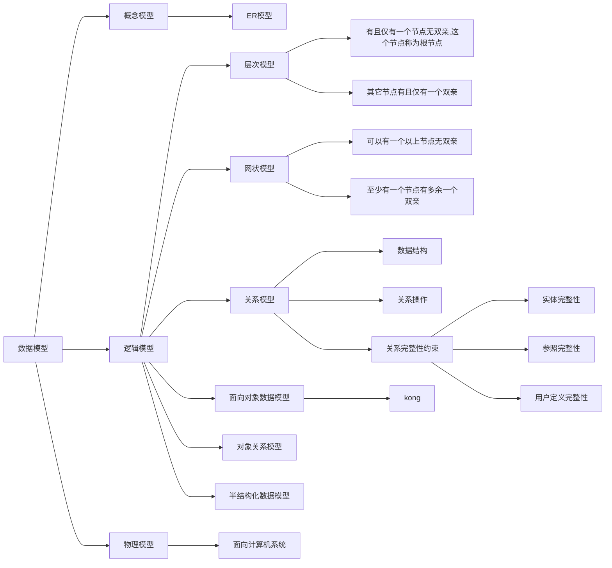

# 一、数据库系统概述

## 1.1数据库系统基本概念

* **数据**：==数据是用来记录信息的可识别符号==，是信息的具体表现形式
* **数据库（DB)**：数据库是长期存储在计算机外存上的、有组织的、可共享的数据集合
* **数据库管理系统（DBMS)**:==数据库管理系统是一个对数据库进行统一管理和控制的系统软件。==位于用户与操作系统之间。对数据的一切操作，包括定义、查询、更新及各种控制，都是通过DBMS进行的。
    * ==DBMS主要功能如下：==
        1. ==数据定义功能==
        2. ==数据操纵功能==
        3. ==数据库运行管理功能==
        4. ==数据库的建立和维护功能==
* **数据库系统（DBS）**：

* 数据管理技术的发展经历了==人工管理阶段==、==文件系统阶段==、==数据库系统阶段==。
    * 文件系统的特点：
        * 数据共享性差
        * 数据独立性差
* 数据库系统的特点：
    1. 面向全组织的复杂的数据结构
    2. 数据的共享性高、冗余度小、易扩充
    3. 有较高的数据和程序独立性
    4. 统一的数据控制功能

## 1.2数据模型

## 1.3数据库体系结构

### 1.3.1数据库系统的三级模式

* 数据库系统的三级模式结构是：外模式、模式、内模式。
* **模式**：是数据库中全体数据的==总体逻辑描述==，用于对数据库逻辑结构和内容所进行描述。==模式的主体是数据库的数据模型==
* **外模式**：是个别用户涉及的数据库的==局部逻辑结构描述==，是个别用户的数据视图，始于某一应用有关的数据的逻辑表示
* **内模式**：既定义了数据库中全部数据的物理结构，还定义了数据的存储方法，存储策略。
* 模式是各外模式的逻辑汇总，内模式是模式的具体实现。==一个数据库可以有多个外模式，而模式和内模式只能有一个。==

### 1.3.2数据库系统的模式映像与数据独立性

* DMBS提供了数据库的二级映像：即==外模式/模式映像==、==模式/内模式映像==

* 两级映像：
    * 当==模式改变==时 只要相应==改变外模式/模式映像==，可使==外模式保持不变==。——对应数据的逻辑独立性
    * 当数据库的==存储结构改变==时，即==内模式改变==时，只要相应==改变模式/内模式映像==，可使==模式保持不变==。——对应数据的物理独立性

* 两级数据独立性：
    * ==数据独立性是指应用程序与数据库的数据结构之间相互独立，互不影响==
    * **数据的物理独立性**  ：
        * 当数据库的==内模式要修改==时，即数据库的物理存储结构发生变化时，由数据库管理员对==模式/内模式映像做相应修改==，使==模式尽可能保持不变==，从而使==外模式和应用程序保持不变==。
    * **数据的逻辑独立性**：
        * 当数据库的==模式要修改==时，有数据库管理员对各个==外模式/模式做相应修改==，使==外模式和应用程序尽可能保持不变==。

# 二、关系模型

## 2.1关系

* 码：
    * **候选码**：若关系中某一属性组的值能唯一标识一个元组，则称该属性组为候选码。
    * **全码**：关系模式的所有属性组是这个关系模式的候选码，称为全码。
    * **主码**：若一个关系有多个候选码，则选定其中一个为主码
    * **主属性**：候选码的属性称为主属性。

## 2.2关系代数

* 五种基本的关系代数运算：`∪、-、×、π、σ`

### 2.2.1传统的集合运算

1. 并
2. 差
3. 交：`R∩S=R-(R-S)`
4. 广义笛卡尔积

### 2.2.2专门的关系运算

1. 投影
2. 选择
3. 连接：==R与S的连接运算就是从R×S笛卡尔积中，挑选R的第i列和S的第j列上的分量满足θ比较条件的那些元组==。
    * 设关系R与关系S分别是n元和m元关系，θ是算术比较符，i和j分别是R的第i列和S的第j列，则
5. 自然连接：==要求两个关系中进行比较的分量必须是相同的属性组，并且在结果中把重复的属性列去掉。==
6. 外连接
7. 除

## 2.3关系完整性

* **实体完整性**：——针对主码
    * ==若属性A是基本关系R的主属性，则属性A不能取空值。==
* **参照完整性**：——针对外码
    * ==若属性F是基本关系R的外码，它与基本关系S的主码Ks相对应（基本关系R和S不一定是不同的关系），则对于R中的每个元组在F上的取值必须为：取空值或者等于S中某个元组的主码值。==

* **用户定义的完整性**：
    * 某一具体应用所涉及的数据必须满足语义要求。

# 三、关系数据库标准语言

## 3.1结构化查询语言概述

* SQL的功能：==数据定义==、==数据操纵==、==数据查询==、==数据控制==

| SQL功能  | 动词     | 作用                                           |
| -------- | -------- | ---------------------------------------------- |
| 数据定义 | `create` | 模式的定义，包括创建数据库、数据表、视图、索引 |
|          | `alter`  | 修改数据表、索引                               |
|          | `drop`   | 删除数据库、数据表、视图、索引                 |
| 数据查询 | `select` | 数据检索                                       |
| 数据更新 | `insert` | 插入数据                                       |
|          | `delete` | 删除数据                                       |
|          | `update` | 更新数据                                       |
| 数据控制 | `grant`  | 授权                                           |
|          | `revoke` | 撤销授权                                       |

## 3.2视图

* 视图与基本表的联系：
    1. 视图是一个虚表，它是从一个或几个基本表（或视图）导出的表。
    2. 数据库中只存放视图的定义，而不存放视图对应的数据，当基本表中的数据发生变化时，从视图中查询出的数据也随之改变。
    3. 视图一经定义就可以像基本表一样被查询、删除，也可以在一个视图之上在定义新的视图，但是对视图的更行操作有限制。
* 使用视图有以下几个优点：
    1. 视图能够简化用户操作
    2. 视图能够提供数据保密
    3. 视图能够保证数据的逻辑独立性
    4. 视图使用户能以多种角度看待同一数据

# 四、事务与并发控制

## 1、事务的特性

==事务是数据库并发控制和恢复的基本单位。==

1. **原子性**
    * 事务是数据库的逻辑工作单位，事务中的操作要么都做，要么都不做。
2. **一致性**
    * 事务执行的结果必须是使数据库从一个一致性状态转到另一个一致性状态。
3. **隔离性**
    * 数据库中一个事务的执行不能被其它事务干扰。
4. **持久性**
    * 事务一旦提交，则其对数据库中数据的改变就是永久的。

## 2、并发控制

* 并发控制是衡量一个数据库管理系统性能的重要标志之一。

* 并发执行可能引起的问题

    1. **丢失数据修改**

       | T1                                  | T2                |
            | ----------------------------------- | ----------------- |
       | ①R(A)=16                            |                   |
       | ②                                   | R(A)=16           |
       | ③$A\leftarrow A-1$     W(A)=15 |                   |
       | ④                                   | $A\leftarrow A-1$ |

    2. **读脏数据**

       | T1                                        | T2       |
            | ----------------------------------------- | -------- |
       | ①R(C)=100                                 |          |
       | ②$C\leftarrow C\times2$     W(C)=200 |          |
       | ③                                         | R(C)=200 |
       | ④ROLLBACK C恢复为100                 |          |

    3. **不可重复读**

       | T1                     | T2                                   |
            | ---------------------- | ------------------------------------ |
       | ①R(A)=50 R(B)=100 |                                      |
       | 求和=150               |                                      |
       | ②                      | R(B)=100                             |
       |                        | $B\leftarrow B\times2$ W(B)=200 |
       | ③R(A)=50 R(B)=200 |                                      |
       | 求和=250               |                                      |
       | 验算不对               |                                      |

    4. **产生幽灵数据**

* 产生数据不一致性的主要原因是并发操作破坏了事务的隔离性。并发控制机制就是要用正确的方式调度并发操作，使一个用户事务的执行不受其它事务的干扰，从而避免造成数据的不一致性。

## 3、封锁和封锁协议

### 3.1封锁

* 基本的封锁类型有两类：==排他锁(简记为**X**锁)==、==共享锁(简记为**S**锁)==

* **排他锁**又称为写锁。==若事务T对数据对象加上X锁，则只允许T读取和修改A，其它任何事务都不能再对A加任何类型的锁，直到T释放A上的锁==。从而保证其它事务在T释放A上的锁之前不能再读取和修改A。

* **共享锁**又称为读锁：==若事务T对数据对象加上S锁，则事务T可以读A，但不能修改A，其它事务只能在再对A加S锁，而不能加X锁，直到T释放A上的锁==。从而保证其它事务可以读A，但在T释放A上的锁之前不能对A做任何修改。

* 三级封锁协议：

  | 封锁协议 | X锁（对写的数据） | S锁（对只读的数据）      | 是否解决“丢失数据修改” | 是否解决“读脏数据” | 是否解决”不可重复读“ |
    | -------- | ----------------- | ------------------------ | ---------------------- | ------------------ | -------------------- |
  | 一级     | 事务全程加锁      | 不加                     | 是                     | 不能保证           | 不能保证             |
  | 二级     | 事务全程加锁      | 事务开始加锁，读完就释放 | 是                     | 是                 | 不能保证             |
  | 三级     | 事务全程加锁      | 事务全程加锁             | 是                     | 是                 | 是                   |

### 3.2并发调度的可串行性

* 可串行性是并发事务正确调度的准则。一个给定的并发调度，当且仅当它是可串行化的，才认为是正确的调度策略。

### 3.3两段锁协议

* 两段锁协议要求每个事务分为两个阶段提出加锁和解锁申请。
* 第一阶段为==增长阶段==，==在此阶段事务可以获得锁，但不能释放锁。==
* 第二阶段为==缩减阶段==，==在此阶段事务可以释放锁，但不能获得锁。==

# 五、数据库故障恢复

## 1、概述

* 数据库故障恢复就是把数据库从错误状态恢复到某一已知的正确状态
* 恢复机制涉及的两个关键问题一个是如何建立冗余数据，另一个是如何用这些冗余数据实施数据库恢复
* 建立冗余数据的技术有很多，例如，为==数据备份==、==登记日志文件==、数据库恢复、数据库镜像等

* 常见的故障类型：
    1. 事务内部故障
    2. 系统故障
    3. 介质故障
    4. 计算机病毒

## 2、数据库恢复技术

* 建立冗余数据的方法主要有==数据库转储法==和==日志文件法==

### 2.1数据库转储法

* **静态转储**：在系统中没有事务运行的情况下进行转储称为静态转储
* **动态转储**：允许事务并发执行的转储

### 2.2日志文件法

* 日志文件是用来记录事务对数据库更新操作的文件，日志文件从格式上分为以记录为单位的日志文件和以数据块为单位的日志文件。
* 日志文件发必须遵循==以下两条原则==
    1. ==事务每一次对数据库的更新都必须写入日志文件，一次更新在日志文件中有一条记录更新工作的记录==
    2. ==必须先把日志记录写到日志文件中，再执行更新操作，即日志先写原则。==

* 日志文件主要用于==事务故障恢复==、==系统故障恢复==、协助后备副本进行==介质故障恢复==。

## 3、数据库恢复策略

* 事务故障的恢复
* 系统故障的恢复
    1. ==第一步：正向扫描日志文件，产生重做队列和撤销队列==
    2. ==第二步：对撤销队列事务进行撤销处理==
    3. ==第三步：对重做队列事务进行重做处理==

* 介质故障的恢复
    1. 装入最新的后备数据库副本，使数据库恢复到最近一次转储时的一致性状态
    2. 装入有关的日志文件副本，重做已完成事务

# 六、关系数据库规范化理论

## 1、函数依赖

* ==关系模式的形式化定义==：
    * 关系模式的形式化定义是指关系模式由五部分组成，是一个五元组，形如：==R(U,D,DOM,F)==。
    * R表示关系名；U表示组成该关系的属性名集合；D表示属性组U中属性所来自的域；DOM表示属性向域的映像集合；F表示属性间数据的依赖关系集合。
* 平凡函数依赖和非平凡函数依赖
* 完全函数依赖和部分函数依赖
* 候选码的求解方法：
    * ==推论1：对于给定的关系模式R及其函数依赖集F，若X是L类属性，则X必为R的任一候选码成员。==
    * 推论2：对于给定的关系模式R及其函数依赖集F，若X是L类属性，且X^+^包含R的全部属性，则X必为R的唯一候选关键字
    * ==推论3：对于给定的关系模式R及其函数依赖集F，若X是R类属性，则X不包含在任何候选码中==
    * ==推论4：对于给定的关系模式R及其函数依赖集F，若X是N类属性，则X必为R的任一候选码成员。==
    * 推论5：对于给定的关系模式R及其函数依赖集F，若X是N类和L类组成的属性集，且X^+^包含R的全部属性，则X必为R的唯一候选关键字
    * ==推论6：对于给定的关系模式R及其函数依赖集F，若X是LR类属性，则X可能包含在关系模式R的某个候选码中。==
    * 如果某个L类属性或N类属性不能单独作为候选码，那么可以将LR类属性逐个或全部与L类属性或N类属性组合，进一步计算这些属性集的闭包，并判断其闭包是否为属性全集。

## 2、关系规范化

* ==关系数据库设计的目的是消除部分函数依赖和传递函数依赖。==
* 不好的数据库可能会出现的问题：
    1. 数据冗余问题
    2. 数据更新问题
    3. 数据插入问题：应该插入的数据未被插入
    4. 数据删除问题：不该删除的数据被删除

### 2.1范式简介

* 在关系数据库中，关于数据表设计的基本原则、规则就称为范式。

### 2.2范式都包括哪些

* 目前关系数据库有六种常见范式，按照范式级别，从低到高分别是：==第一范式（1NF）==、==第二范式（2NF）==、==第三范式（3NF）==、==巴斯-科德范式（BCNF）==、==第四范式（4NF）==、==第五范式（5NF，又称完美范式）==。

* 一般来说，在关系型数据库设计中，最高也就遵循到BCNF，普遍还是3NF。但也不绝对，有时候为了提高某些查询功能，我们还需要破环范式规则，也就是==反规范化==。

### 2.3第一范式（1NF）

* 关系模式R的所有属性都是不可分的基本项。

### 2.4第二范式（2NF）

* 若关系模式R属于第一范式，==且每一个非主属性都完全函数依赖于主码==，则称R属于第二范式。

* 例如：

    * 比赛表 `player_game`,里面包含球员编号、姓名、年龄、比赛编号、比赛时间和比赛场地等属性,这里候选键和主键都为(球员编号,比赛编号),我们可以通过候选键(或主键)来决定如下的关系:

    * `(球员编号,比赛编号)→(姓名,年龄,比赛时间,比赛场地,得分)`但是这个数据表不满足第二范式,因为数据表中的字段之间还存在着如下的对应关系:

    * `(球员编号)→(姓名:年龄)`

    * `(比赛编号)→(比赛时间,比赛场地)`

### 2.5第三范式（3NF）

* 若关系模式属于第二范式，==且每一个非主属性不传递函数依赖于主码==，则称R属于第三范式。也就是说，要求数据表中的所有非主键字段不能依赖于其它非主键字段。

### 2.6BCNF(巴斯范式)

* ==若关系模式R属于第一范式，若X→Y且Y⊊X时(这是一个非平凡的函数依赖)，X必包含候选码，则称R属于BC范式==。==通俗地讲，当且仅当关系中地每个函数依赖地决定因子都是候选码时，该范式即为BCNF。==

## 3、模式分解

* 关系模式的分解主要是体现分解等价的原则，对于“等价”的概念从不同角度形成了以下三中不同的定义：
    1. 分解具有无损连接性
    2. 分解要保持函数依赖
    3. 分解既要保持函数依赖，又要具有无损连接性
* 分解为3NF
* 分解为BCNF

# 七、数据库设计方法

## 1、数据库设计概述

* 数据库设计分为六个阶段，分别是：==需求分析、概念结构设计、逻辑结构设计、物理结构设计、数据库实施、数据库运行和维护==。需求分析和概念结构设计独立于任何数据库管理系统，逻辑结构设计和物理结构设计则与选用的数据库管理系统密切相关。

## 2、数据库结构设计

### 2.1概念结构设计

* 分ER图可能存在的问题：==属性冲突==、==命名冲突==、==结构冲突==。
* E-R模型主要由：==实体、属性、联系==三部分组成。

### 2.2逻辑结构设计——形成数据的外模式

下面关于E-R图向关系数据模型的转换原则和方法。

1. 转换原则1：实体性的转换
    * ==一个实体性转换为一个关系模式==
2. 转换原则2：实体性间的联系的转换
    * **一对一联系**：可以转换为一个独立的关系模式，也可以与联系的任意一端实体所对应的关系模式合并。
    * **一对多联系**：可以转换为一个独立的关系模式，也可以与联系的n端实体所对应的关系模式合并
    * **多对多联系**：==对于实体性之间的多对多联系，只能转换为一个独立的关系模式，此时与该联系相连的各实体的主码以及联系本身的属性是关系模式的属性，关系模式的主码是各实体主码的组合。==
    * **三个或三个以上实体间的一个多元联系**：对于三个或三个以上实体间的一个多元联系，只能转换为一个多元模式。此时与该多元联系相连的各实体的主码以及联系本身的属性是关系模式的属性，关系模式的主码是各实体主码的组合。

### 2.3物理结构设计——形成数据库的内模式

* 数据库再物理存储设备上的==存储结构==与==存取方法==称为数据库的物理结构，它依赖于选定的数据库管理系统。
* 确定数据库的物理存储结构在关系数据库管理系统中主要指==存取方法和存取结构==；对物理结构进行评价重点关注==时间和空间的使用效率==。

# 八、编写SQL语句

## 1、基本表的创建、删除、修改

## 2、索引的创建与删除

* 语法：`create [unique] [cluster] index <索引名> on <表名>`
* `unique`表示建立唯一索引
* `cluster`表示建立聚簇索引
  

## 3、数据查询

## 4、数据更新

### 4.1插入数据

### 4.2删除数据

### 4.3修改数据

## 5、视图的创建与删除

1. 定义视图
   
    * 子查询中不允许含有`order by`子句和`distinct`短语
    * 带可选项`with check option`表示对视图进行更新操作时系统自动加上视图定义中的谓词条件。
2. 删除视图：`drop view <视图名>`

## 6、存储过程

## 7、触发器

* 当用户对表进行增、删、改等操作时，服务器自动激活相应的触发器，在DBMS核心层进行集中的完整性控制。
  