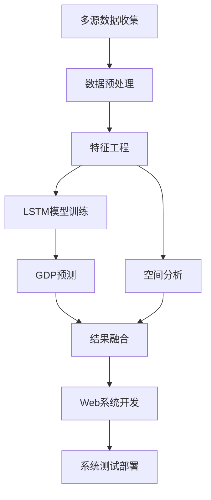

# 项目规划

## 🗺️ 第一阶段：数据准备与预处理

### 1.1 GDP数据获取与处理
- **数据获取**：使用国家统计局API或直接下载CSV
- **数据清洗**：
  - 处理缺失值（线性插值或前后填充）
  - 统一城市名称（与shp文件中的名称匹配）
  - 转换为面板数据格式：`[城市, 年份, GDP值]`

### 1.2 地理边界数据处理
- **坐标系统一**：将所有shp文件转换为WGS84 (EPSG:4326)
- **属性表整理**：确保有城市名称字段用于数据关联
- **数据简化**：如果数据量过大，适当简化几何体提高性能

## 🤖 第二阶段：GDP预测建模

### 2.1 数据准备
```python
# 伪代码示例
import pandas as pd
import numpy as np
from sklearn.preprocessing import MinMaxScaler
from tensorflow.keras.models import Sequential
from tensorflow.keras.layers import LSTM, Dense

# 数据预处理
def prepare_gdp_data(df, lookback=5):
    """
    df: 包含城市、年份、GDP的数据框
    lookback: 用过去多少年的数据预测下一年
    """
    # 按城市分组，创建时间序列
    # 归一化处理
    # 构建监督学习数据集: X=[t-lookback到t-1], y=[t]
    return X_train, y_train, X_test, y_test
```

### 2.2 LSTM模型构建
```python
def build_lstm_model(lookback, n_features):
    model = Sequential([
        LSTM(50, return_sequences=True, input_shape=(lookback, n_features)),
        LSTM(50, return_sequences=False),
        Dense(25),
        Dense(1)
    ])
    model.compile(optimizer='adam', loss='mse')
    return model
```

### 2.3 模型训练与预测
- **按城市训练**：为每个重要城市训练单独的LSTM模型
- **区域聚合**：对于数据量小的城市，按经济区域聚合训练
- **预测未来3-5年**的GDP趋势

## 📊 第三阶段：空间分析

### 3.1 空间权重矩阵
```python
import libpysal as lps
from esda.moran import Moran, Moran_Local
from esda.getisord import G_Local

# 创建空间权重矩阵
w = lps.weights.Queen.from_dataframe(gdf)  # 或Rook权重
w.transform = 'r'  # 行标准化
```

### 3.2 全局空间自相关
```python
# Moran's I 分析
moran = Moran(gdf['GDP'], w)
print(f"Moran's I: {moran.I}, p-value: {moran.p_sim}")
```

### 3.3 局部空间自相关 (LISA)
```python
# 局部Moran's I
lisa = Moran_Local(gdf['GDP'], w)
# 分类：高高聚集(HH)、低低聚集(LL)、高低聚集(HL)、低高聚集(LH)
```

### 3.4 冷热点分析 (Getis-Ord Gi*)
```python
# 冷热点分析
g_local = G_Local(gdf['GDP'], w)
# 分类：热点区、冷点区、不显著
```

## 🌐 第四阶段：WebGIS系统开发

### 4.1 技术栈选择
- **前端**：OpenLayers + HTML + CSS + JavaScript
- **后端**：Python Flask/FastAPI 或 Node.js
- **数据服务**：GeoJSON API

### 4.2 系统架构设计
```
前端 (OpenLayers)
    ↓
API接口 (Flask/FastAPI)
    ↓
数据层 (GeoJSON + 预测结果)
    ↓
分析层 (Python空间分析)
```

### 4.3 核心功能实现

#### 地图初始化
```javascript
// OpenLayers 地图初始化
var map = new ol.Map({
    target: 'map',
    layers: [
        new ol.layer.Tile({
            source: new ol.source.OSM()
        }),
        new ol.layer.Vector({
            source: vectorSource,
            style: featureStyleFunction
        })
    ],
    view: new ol.View({
        center: ol.proj.fromLonLat([104.0, 35.0]),
        zoom: 4
    })
});
```

#### 分级设色渲染
```javascript
// 根据GDP值设置不同颜色
function getColorByGDP(gdpValue) {
    if (gdpValue > 10000) return '#006837';
    else if (gdpValue > 5000) return '#31a354';
    else if (gdpValue > 1000) return '#78c679';
    else if (gdpValue > 500) return '#c2e699';
    else return '#ffffcc';
}
```

#### 点击交互
```javascript
// 点击显示详细信息
map.on('click', function(evt) {
    var feature = map.forEachFeatureAtPixel(evt.pixel, function(feature) {
        return feature;
    });
    
    if (feature) {
        showPopup(feature.getProperties());
    }
});
```

## 📁 项目组织建议

```
project/
├── data/
│   ├── raw/           # 原始数据
│   ├── processed/     # 处理后的数据
│   └── geojson/       # 转换后的GeoJSON
├── models/
│   ├── gdp_forecast.py    # GDP预测模型
│   └── model_weights/     # 训练好的模型权重
├── spatial_analysis/
│   ├── moran_analysis.py  # 空间自相关分析
│   └── hotspot_analysis.py # 冷热点分析
├── webgis/
│   ├── app.py         # Flask后端
│   ├── static/        # 静态文件
│   └── templates/     # HTML模板
├── docs/              # 文档和报告
└── requirements.txt   # 依赖包列表
```

## 🚀 实施策略建议

### 分阶段实施：
1. **第一周**：完成数据收集和预处理
2. **第二周**：实现GDP预测模型
3. **第三周**：完成空间分析
4. **第四周**：开发WebGIS系统并整合
5. **第五周**：测试优化和文档编写

### 关键技术要点：
- **数据一致性**：确保统计数据和空间数据的城市名称匹配
- **模型评估**：使用RMSE、MAE等指标评估预测效果
- **性能优化**：对于大量矢量数据，考虑数据简化和服务端渲染
- **用户体验**：提供图例、比例尺、搜索等交互功能

### 扩展功能建议：
- 添加多指标分析（人均GDP、GDP增长率等）
- 实现时间轴播放，展示GDP时空演变
- 添加对比分析功能（两个城市对比）
- 生成分析报告自动导出

这个项目完成后将是一个很完整的数据科学作品，祝你顺利完成！如果有具体的技术问题，可以随时追问。


# 总体设计方案

根据你提供的考核标准和项目需求（栅格数据+CSV，城市GDP预测与分布分析），我来帮你设计一个完整的总体设计方案框架。请参考以下结构来填写你的文档：

## 1. 项目介绍

### 1.1 项目背景与意义
随着中国城市化进程加速，城市经济发展不平衡问题日益凸显。准确预测城市GDP发展趋势并分析其空间分布特征，对区域经济规划、资源配置和政策制定具有重要意义。

### 1.2 项目概述

本项目基于栅格遥感数据和城市GDP统计CSV数据，构建一个集GDP时序预测、空间分布分析和可视化展示于一体的城市经济分析系统。通过融合深度学习与空间分析技术，实现城市经济发展的多维度洞察。

### 1.3 技术方法综述
- **GDP预测**：采用LSTM神经网络处理时序数据
- **空间分析**：结合Moran's I和Getis-Ord Gi*进行空间自相关分析
- **数据融合**：栅格数据（夜间灯光、土地利用）与统计数据的多源融合
- **可视化**：基于OpenLayers的WebGIS系统开发

### 1.4 预期功能
- 城市GDP多年度预测
- 空间集聚模式识别
- 经济发展冷热点区域分析
- 交互式时空可视化展示

### 1.5 技术难点
- 多源异构数据融合与标准化
- 小样本城市GDP预测精度提升
- 空间尺度不一致问题处理
- 大规模栅格数据Web端高效渲染

## 2. 技术原理

### 2.1 时序预测技术（LSTM）
长短期记忆网络通过门控机制解决传统RNN的梯度消失问题，特别适合处理具有长期依赖关系的时序数据。本项目采用多变量LSTM，结合历史GDP数据和栅格衍生特征进行联合预测。

**创新点**：引入夜间灯光强度作为GDP预测的辅助变量，提升模型在数据缺失情况下的预测鲁棒性。

### 2.2 空间分析技术
#### 2.2.1 全局空间自相关（Moran's I）
度量整个研究区域内经济指标的空间集聚程度，公式：
\[ I = \frac{n}{\sum_{i=1}^{n}\sum_{j=1}^{n}w_{ij}} \times \frac{\sum_{i=1}^{n}\sum_{j=1}^{n}w_{ij}(x_i-\bar{x})(x_j-\bar{x})}{\sum_{i=1}^{n}(x_i-\bar{x})^2} \]

#### 2.2.2 局部空间自相关（LISA）
识别局部集聚模式（HH、LL、HL、LH），揭示经济发展空间异质性。

#### 2.2.3 冷热点分析（Getis-Ord Gi*）
识别统计显著的热点区（高值集聚）和冷点区（低值集聚）。

**创新点**：结合多年份分析，揭示经济发展空间格局的演化趋势。

### 2.3 多源数据融合技术
通过空间连接将栅格数据属性（夜间灯光强度、植被指数等）与行政区划矢量数据关联，构建增强型城市特征数据集。

## 3. 项目环境

### 3.1 软件环境
- **开发语言**：Python 3.8+, JavaScript
- **深度学习框架**：TensorFlow 2.8/PyTorch 1.12
- **空间分析库**：GeoPandas, PySAL, GDAL
- **Web框架**：Flask/FastAPI, OpenLayers 7.x
- **数据库**：PostgreSQL + PostGIS
- **可视化**：ECharts, Chart.js

### 3.2 硬件环境
- CPU：Intel i7以上
- 内存：16GB以上
- 存储：500GB SSD
- GPU：NVIDIA GTX 1660以上（可选，加速模型训练）

### 3.3 数据来源
- **GDP统计数据**：国家统计局官网CSV格式
- **栅格数据**：Landsat系列遥感影像、NPP/VIIRS夜间灯光数据
- **行政区划**：全国县级行政区划矢量数据

## 4. 技术方案

### 总体技术路线图


### 4.1 数据预处理与特征工程模块

#### 4.1.1 数据处理流程
1. **CSV数据清洗**
   - 缺失值处理（线性插值/多重插补）
   - 异常值检测与处理
   - 城市名称标准化

2. **栅格数据处理**
   - 辐射定标与大气校正
   - 影像裁剪与重投影
   - 夜间灯光指数提取
   - 植被指数计算

3. **数据融合**
   - 基于行政区划的空间连接
   - 时序特征构建
   - 训练集/测试集划分

#### 4.1.2 关键技术
- 使用GDAL进行栅格数据处理
- 基于Scikit-learn的特征标准化
- 滑动窗口构建时序样本

### 4.2 GDP预测分析模块

#### 4.2.1 LSTM模型架构

```
Input Layer → LSTM(64) → Dropout(0.2) → 
LSTM(32) → Dropout(0.2) → Dense(16) → Output Layer
```

#### 4.2.2 预测流程
1. 单变量GDP序列预测（基准模型）
2. 多变量预测（GDP+夜间灯光+其他特征）
3. 模型评估：RMSE, MAE, R²
4. 未来3年GDP预测

#### 4.2.3 创新设计
- 引入注意力机制提升长序列预测性能
- 集成学习结合多个LSTM模型提升稳定性

### 4.3 空间分布分析模块

#### 4.3.1 分析流程
1. **空间权重矩阵构建**
   - 邻接权重（Queen Contiguity）
   - 距离权重（K-nearest Neighbors）

2. **全局空间自相关分析**
   - Moran's I计算与显著性检验
   - 多年份变化趋势分析

3. **局部空间模式识别**
   - LISA聚类地图生成
   - 冷热点分析可视化

#### 4.3.2 输出成果
- 空间自相关统计报告
- LISA聚类分布图
- 经济发展冷热点地图

### 4.4 WebGIS可视化系统模块

#### 4.4.1 系统架构
```
前端(OpenLayers + HTML/CSS/JS)
    ↑
RESTful API (Flask)
    ↑
业务逻辑层 (Python)
    ↑
数据层 (PostGIS + 文件存储)
```

#### 4.4.2 核心功能
1. **地图展示**
   - 分级设色显示GDP分布
   - 时间轴播放多年变化
   - 图例与比例尺

2. **交互功能**
   - 点击查询城市详细信息
   - 多指标对比分析
   - 预测结果动态展示

3. **图表组件**
   - GDP历史趋势图
   - 空间分析结果图表
   - 预测置信区间展示

## 5. 预期任务分工

| 成员  | 主要职责              | 具体任务                                                     |
| ----- | --------------------- | ------------------------------------------------------------ |
| 成员A | 项目经理 & 数据预处理 | 1. 项目进度管理<br>2. GDP数据收集与清洗<br>3. 栅格数据预处理 |
| 成员B | 模型开发工程师        | 1. LSTM模型设计与实现<br>2. 模型训练与调优<br>3. 预测结果评估 |
| 成员C | 空间分析师            | 1. 空间自相关分析<br>2. 冷热点分析<br>3. 空间分析报告生成    |
| 成员D | 前端开发工程师        | 1. OpenLayers地图开发<br>2. 交互功能实现<br>3. 界面美化优化  |
| 成员E | 后端开发工程师        | 1. Flask API开发<br>2. 数据库设计<br>3. 系统集成测试         |

## 5.1 里程碑计划
- **第1-2周**：数据准备与预处理
- **第3-4周**：模型开发与空间分析
- **第5周**：Web系统开发
- **第6周**：系统集成测试与报告撰写

## 5.2 风险评估与应对
- **数据质量问题**：准备数据补全方案
- **模型预测偏差**：准备多种模型对比
- **系统性能问题**：优化数据加载策略
```

## 💡 关键得分点提醒

根据考核标准，你的设计方案要特别注意：

1. **创新性**（对应课程目标1-优）：
   - 在至少2个模块体现创新（如：夜间灯光数据辅助预测、注意力机制LSTM）
   - 多源数据融合的创新应用

2. **技术深度**：
   - 详细阐述LSTM、空间分析的技术原理
   - 体现对工具选择的合理性

3. **完整性**：
   - 覆盖数据处理→分析→可视化全流程
   - 包含详细的任务分工和时间计划

4. **规范性**：
   - 使用专业术语和图表
   - 遵循软件开发流程

现在你可以基于这个框架填充具体内容，记得根据你们组的实际情况调整任务分工和技术细节。需要我帮你完善某个特定部分吗？
```

# 技术原理

## 1. 时序预测技术原理

### 1.1 LSTM（长短期记忆网络）
**核心原理**：

```python
# LSTM单元的门控机制
输入门：i_t = σ(W_i·[h_{t-1}, x_t] + b_i)
遗忘门：f_t = σ(W_f·[h_{t-1}, x_t] + b_f)  
输出门：o_t = σ(W_o·[h_{t-1}, x_t] + b_o)
候选记忆：g_t = tanh(W_g·[h_{t-1}, x_t] + b_g)
记忆更新：c_t = f_t ⊙ c_{t-1} + i_t ⊙ g_t
隐藏状态：h_t = o_t ⊙ tanh(c_t)
```

**在GDP预测中的优势**：

- 捕捉经济数据的长期依赖关系（如经济周期）
- 处理非平稳时间序列
- 抵抗梯度消失，适合长序列预测

### 1.2 注意力机制增强LSTM
**创新原理**：

```
Attention权重：α_t = softmax(score(h_t, h_i))
上下文向量：c = Σ(α_i · h_i)
最终输出：y = f(c, h_t)
```
**作用**：让模型关注对预测最关键的历史时刻

## 2. 空间分析技术原理

### 2.1 全局空间自相关（Moran's I）
**数学原理**：
```
Moran's I = (n/∑∑w_ij) × [∑∑w_ij(x_i-μ)(x_j-μ)] / ∑(x_i-μ)²
其中：
  n: 空间单元数量
  w_ij: 空间权重矩阵元素
  x_i, x_j: 位置i,j的属性值
  μ: 属性均值
```

**经济意义**：
- I > 0：GDP空间正相关（集聚）
- I < 0：GDP空间负相关（分散）  
- I ≈ 0：随机分布

### 2.2 局部空间自相关（LISA）
**原理公式**：
```
Local Moran's I_i = z_i × ∑(w_ij × z_j)
其中 z_i = (x_i - μ)/σ
```

**四种空间关联模式**：
- **HH（高-高）**：高GDP城市被高GDP城市包围
- **LL（低-低）**：低GDP城市被低GDP城市包围  
- **HL（高-低）**：高GDP城市被低GDP城市包围
- **LH（低-高）**：低GDP城市被高GDP城市包围

### 2.3 Getis-Ord Gi* 冷热点分析
**统计原理**：
```
Gi* = [∑(w_ij × x_j) - μ∑w_ij] / [σ√((n∑w_ij² - (∑w_ij)²)/(n-1))]
```
**分类标准**：
- **热点区**：Gi*显著为正，高值集聚
- **冷点区**：Gi*显著为负，低值集聚
- **不显著**：Gi*接近0

## 3. 多源数据融合原理

### 3.1 夜间灯光数据与GDP相关性
**理论基础**：
- **经济地理学**：夜间灯光强度与经济活动强度正相关
- **遥感原理**：DMSP/OLS和NPP/VIIRS传感器捕获人类活动
- **统计验证**：大量研究证实灯光总量与GDP的R² > 0.85

### 3.2 特征工程原理
```python
# 多源特征构建
features = {
    '历史GDP': ['GDP_t-1', 'GDP_t-2', 'GDP增长率'],
    '灯光特征': ['灯光总量', '灯光均值', '灯光标准差'],
    '空间特征': ['邻接城市GDP均值', '距离权重GDP'],
    '衍生特征': ['人均GDP', 'GDP密度', '产业结构']
}
```

## 4. 空间计量经济学原理

### 4.1 空间依赖性
**理论依据**：

- **地理学第一定律**："一切事物都与其他事物相关，但近处的事物比远处的事物更相关"
- **空间溢出效应**：一个地区的经济发展会影响相邻地区

### 4.2 空间异质性
**表现形式**：

- 东部沿海与西部内陆的发展差异
- 城市群内部的协同效应
- 政策影响的区域性差异

## 5. 技术原理的创新组合

### 5.1 "深度学习+空间分析"融合框架
```
时序预测层(LSTM) → 空间分析层(Moran's I) → 可视化层(WebGIS)
      ↓                    ↓                    ↓
 时间维度洞察        空间维度洞察        时空综合展示
```

### 5.2 多尺度分析原理
- **宏观尺度**：全国/省级空间格局
- **中观尺度**：城市群/经济区分析  
- **微观尺度**：县域经济差异

## 6. 统计检验原理

### 6.1 显著性检验
```python
# Moran's I 显著性检验
Z_score = (I - E[I]) / √Var[I]
# 其中 E[I] = -1/(n-1)
# 拒绝零假设条件：|Z| > 1.96 (p < 0.05)
```

### 6.2 模型评估原理
- **时间序列**：RMSE, MAE, R², MAPE
- **空间模型**：Log-Likelihood, AIC, BIC
- **交叉验证**：时序交叉验证防止过拟合

## 7. 技术原理的实践意义

### 7.1 对政策制定的价值
- **空间集聚识别**：优化区域发展政策
- **趋势预测**：辅助经济规划制定
- **异常检测**：及时发现发展问题区域

### 7.2 对学术研究的贡献
- 验证经济地理学理论
- 探索新的空间分析范式
- 推动多源数据融合方法

这个技术原理框架既包含了经典的统计方法，也融入了前沿的深度学习技术，体现了"传统与现代结合、理论与实务并重"的特点。你需要我进一步解释某个具体的技术原理吗？

